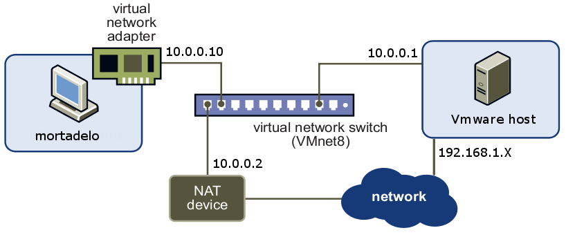
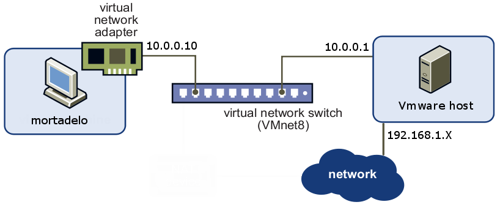

# Configuración de SNAT para la red virtual

Tenemos la siguiente estructura de red:   

Todos los equipos de la red virtual 10.0.0.0/24 están conectados a través del switch virtual. El acceso a la red externa de Mortadelo (10.0.0.10) es mediante el dispositivo de NAT de VMware, que aparece en la imagen con dirección IP 10.0.0.2. Podemos verificar esto viendo la tabla de encaminamiento de mortadelo: <pre>route -n</pre>donde comprobamos que la puerta de enlace para cualquier destino (0.0.0.0/0) es la 10.0.0.2 (dispositivo de NAT).  Puesto que queremos aprender cómo hace NAT un equipo GNU/Linux, utilizaremos el equipo que actúa como host como dispositivo de NAT y prescindiremos del dispositivo de NAT de VMware.  

<h3 style="text-align: justify;">Eliminar el dispositivo de NAT de VMware</h3>

 En el host utilizamos la siguiente instrucción: <pre>ps aux |grep -i NAT</pre>localizamos el PID del proceso NAT de VMware y lo matamos con: <pre>kill -9 PID</pre>O simplemente ejecutamos: <pre>kill $(ps aux |grep -i NAT| grep -v grep |awk '{print $2}')</pre> Otra opción sería eliminar las líneas de configuración de VMware que levantan el dispositivo NAT. 

 

<h3 style="text-align: justify;">Activar el bit de forward</h3>

 Por defecto un equipo GNU/Linux no permite que se pasen paquetes entre sus interfaces de red, pero si queremos que actúe como router o como dispositivo de NAT tenemos que cambiar este comportamiento, activando lo que se denomina bit de forward de alguna de las siguientes maneras: 

<h4 style="text-align: justify;">Directamente</h4>

 Escribimos: <pre>echo 1 &gt; /proc/sys/net/ipv4/ip_forward</pre> 

<h4 style="text-align: justify;">sysctl</h4>

De forma alternativa podemos utilizar sysctl, que permite configurar parámetros del kernel mientras se ejecuta: <pre>sysctl net.ipv4.ip_forward=1</pre> 

<h4 style="text-align: justify;">De forma definitiva: /etc/sysctl.conf</h4>

 Los dos métodos anteriores son equivalentes pero no permanecen tras un reinicio del equipo, para que este cambio se efectúe cada vez que se arranca el equipo editamos el fichero /etc/sysctl.conf, buscamos la línea net.ipv4.ip_forward=1 y la descomentamos. 

<h4 style="text-align: justify;">SNAT con iptables</h4>

 En el host escribe la siguientes instrucciones para borrar todas las reglas de la tabla nat anteriores y poner los contadores a cero: <pre>iptables -t nat -F
iptables -Z </pre> Ahora escribe la instrucción de iptables que hace que el host actúe como dispositivo de NAT para la red virtual: <pre>iptables -t nat -A POSTROUTING -s 10.0.0.0/24 -o eth0 -j SNAT --to 192.168.1.15</pre> donde hemos supuesto que 192.168.1.15 es la dirección que tiene el host en la interfaz de red real conectada a la red local. Si la dirección IP externa del equipo que hace NAT fuese dinámica, tendríamos que sustituir la instrucción anterior por: <pre>iptables -t nat -A POSTROUTING -s 10.0.0.0/24 -o eth0 -j MASQUERADE</pre> 

<h4 style="text-align: justify;">Modificar la puerta de enlace de los equipos de la red virtual</h4>

Puesto que ya no existe el dispositivo de NAT de VMware, tenemos la siguiente estructura de red: 
 

 

Ahora tendremos que configurar los equipos de la red virtual para que tengan la dirección IP 10.0.0.1 como puerta de enlace (gateway) en lugar de la 10.0.0.2. Para ello, edita el fichero /etc/network/interfaces de las máquinas virtuales y reinicia el demonio de red: <pre>/etc/init.d/networking restart</pre>Comprueba la nueva tabla de encaminamiento y si el equipo tiene conexión con la red exterior. 

