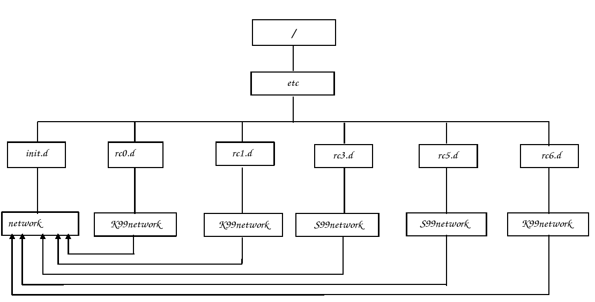

# Niveles de ejecución. Arranque y parada de los servicios
<h1 style="text-align: justify;"> Niveles de ejecución. Arranque y parada de los servicios</h1>

 Los niveles de ejecución ( Run Levels ) definen diferentes estados de funcionamiento de un Sistema Linux.  0 Parada del sistema  1 Modo monousuario  2 Modo multiusuario  3 Modo multiusuario  4 No usado  5 Modo multiusuario  6 Parada y arranque  7-9 No se usan  

<h2 style="text-align: justify;">Secuencia de arranque</h2>

1) Debian arranca ejecutando el programa init. El archivo de configuración de init es /etc/inittab.  La entrada initdefault determina el nivel de ejecución inicial del sistema.  
  <table width="100%" border="1" style="text-align: left; margin-left: 0px; margin-right: 0px;"><tbody>
    <tr>
      <td width="100%" valign="top"> 1) Edita el fichero /etc/inittab, localiza la entrada initdefault, y determina en que nivel de ejecución está trabajando el sistema.  2) También puedes obtener el nivel de ejecución actual ejecutando la instrucción runlevel.  
      </td>
    </tr></tbody>
  </table>  2) Los primeros scripts que se ejecutan a continuación (indicado en la linea del fichero /etc/inittab: si::sysinit:/etc/init.d/rcS) son los que se encuentra en el directorio /etc/rcS. Estos scripts son los encargados de realizar algunas tareas como:   
  <ul style="text-align: justify;">
    <li>Monta el file system root y /proc.</li>
    <li>Elimina temporales y archivos de bloqueo.</li>
    <li>Establece el reloj</li>
    <li>Inicia scripts de red y activa la partición swap.</li>
    <li> Activa el teclado y fuentes.</li>
    <li>Carga módulos.</li>
    <li>Establece valores a muchas variables del entorno:PATH, HOSTNAME,...</li>
    <li>Arranca la swap</li>
    <li>Arranca fsck automático, si hace falta.</li>
    <li>Activa quotas.</li>
    <li>Chequea los argumentos pasados al kernel.</li>
    <li>Chequea los filesystems</li>
    <li>Inicializa los puertos serie.</li>
    <li>Puertos USB.</li>
  </ul>
  <table width="100%" border="1" style="text-align: left; margin-left: 0px; margin-right: 0px;"><tbody>
    <tr>
      <td width="100%" valign="top">  1) Lista los ficheros que se encuentran en el directorio /etc/rcS.d  2) Comprueba que son enlaces simbólicos a los scripts que se encuentran en el directorio /etc/init.d  
      </td>
    </tr></tbody>
  </table>    3) A continuación se ejecutan los scripts de inicialización de los servicios del nivel de ejecución por defecto. Estos scripts se encuentran en los directorios /etc/rcn donde n es el nivel de ejecución.  Ejemplo:  Nivel Script Directorio  0 rc 0 /etc/rc0.d/  1 rc 1 /etc/rc1.d/  2 rc 2 /etc/rc2.d/  3 rc 3 /etc/rc3.d/  Es el script /etc/init.d/rc el que procesa todos los archivos K y S de los directorios /etc/rcn.d  

<ul style="text-align: justify;">
  <li>Para ( con el argumento stop ) aquellos procesos que comienzan por K ( kill )</li>
  <li>Lanza ( con el argumento start ) los que comienzan por S ( start ).</li>
  <li>Después de la letra S o K hay dos dígitos numéricos que indican el orden de ejecución. El orden es ASCII.</li>
  <li>Todos los ficheros K o S son enlaces simbólicos a los scrips de cada servicio que están en el directorio /etc/init.d</li>
</ul>

 

 

<table width="100%" border="1" style="text-align: left; margin-left: 0px; margin-right: 0px;"><tbody>
  <tr>
    <td width="100%" valign="top"> 1) Visualiza los ficheros de los distintos directorios /etc/rcn.d. 2) Comprueba los ficheros de ejecución del nivel de ejecución que se ejecuta por defecto en Debian. 3) Con la instrucción telinit podemos ejecutar otrps niveles de ejecución. Entra en el nivel monousuario. Entra en el nivel de reinicio. Entra en el nivel de parada del sistema. 
    </td>
  </tr></tbody>
</table>

 De modo esquemático podemos ver:    4) ¿Qué hacer para eliminar un servicio en un determinado nivel?  

<ul style="text-align: justify;">
  <li>Borrar el vínculo simbólico en /etc/rcn.d/</li>
  <li>Renombrarlo con algo que no empiece con S o K y dejarlo por si queremos luego activarlo.</li>
  <li>Lo que no hay que hacer nunca es eliminar el archivo original en /etc/init.d/</li>
</ul>

 

<table width="100%" border="1" style="text-align: left; margin-left: 0px; margin-right: 0px;"><tbody>
  <tr>
    <td width="100%" valign="top"> 1) Vamos a eliminar el servicio ssh (encargado de iniciar el servidor gráfico) del nivel de ejecución 2, para ello elimina el fichero que inicia ese servicio. 2) Reinica el sistema y comprueba que el servidor gráfico no se ha iniciado. 3) Para restablecer el enlace simbólico para que podamos iniciar el servicio usamos la instrucción update-rc.d (busca la página del manual para aprender más sobre esta instrucción. Ejecuta:  update-rc.d gdm defaults para crear los enlaces simbólicos que ejecutan el script de gdm 4) Vuelve a reiniciar el sistema y comprueba que el servidor gráfico se vuelve a ejecutar. 5) Pregunta: ¿Para qué podríamos utilizar la configuración de distintos niveles de ejecución?  
    </td>
  </tr></tbody>
</table>

  

<h2 style="text-align: justify;">Arranque y parada de lo servicios</h2>

Una vez que se han cargado los servicios que se encuentran en el directorio /etc/rc2.d, podemos comprobar que los demonios correspondientes a cada servicio se están ejecutando con la instrucción:  <pre># ps -A</pre> En cualquier momento podemos parar o reiniciar cualquier servicio ejecutando los scripts del directorio /etc/init.d con las siguientes opciones: start, stop, restart, force-reload,...    

<table width="100%" border="1" style="text-align: left; margin-left: 0px; margin-right: 0px;"><tbody>
  <tr>
    <td width="100%" valign="top"> 1) Comprueba que el servicio ssh se está ejecutando. 2) Para el servicio, y comprueba con la instrucción ps que el proceso no se está ejecutando. 3) Vuelve a reiniciar el servicio.  
    </td>
  </tr></tbody>
</table>  
<h2 style="text-align: justify;">Envío de señales a los procesos</h2>

Es posible el envío de distintas señales a los procesos. La más usada es matar un proceso, si por ejemplo se queda inactivo. Para ello utilizamos la siguiente instrucción:  <pre>kill -9 PID</pre> El PID es el identificador del proceso, y lo puedes obtener mirando la lista de procesos por ejemplo con ps -A.  Podemos también utilizar la siguiente instrucción  <pre>killall nombredelproceso</pre> Del mismo modo puedes ver el nombre del proceso mirando la lista de procesos con ps.   

<table width="100%" border="1" style="text-align: left; margin-left: 0px; margin-right: 0px;"><tbody>
  <tr>
    <td width="100%" valign="top"> 1) Imagínate que el servidor gráfico se queda &quot;colgado&quot;. Entra en un terminal de texto con CTRL+ALT+F1, y tras iniciar sesión como root mata el proceso gdm (Gestor de arranque del servidor gráfico).  2) Para comprobar que el servidor gráfico no funciona puedes hacer varias cosas: lista los procesos y comprueba que no existe el proceso gdm ni el Xorg. También puedes intentar entrar en la consola gráfica con CTRL+ALT+F7.  3) Vuelve a ejecutar el gestor de arranque gráfico gdm.  4) Del mismo modo puedes matar el demonio del servicio ssh, y volver a reiniciarlo posteriormente.   
    </td>
  </tr></tbody>
</table> 
