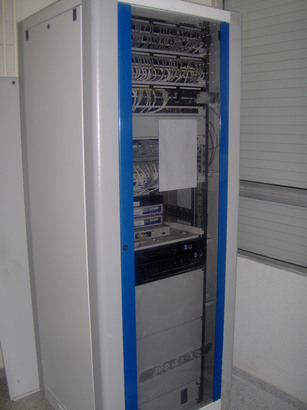
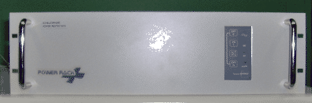
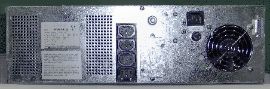
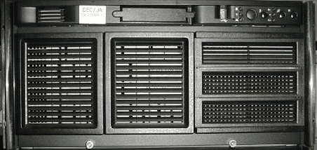
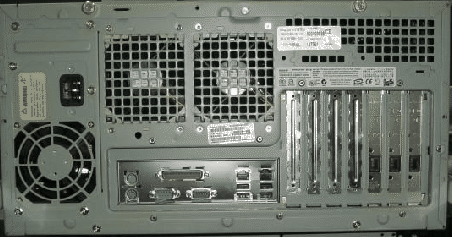
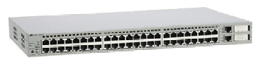
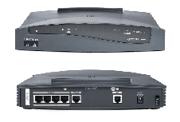
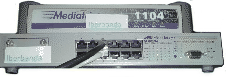
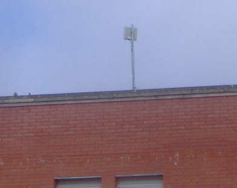

# Componentes Hardware

<h1><a name="SECTION00010000000000000000">
Cableado troncal</a></h1><h1></h1><h1></h1><h1></h1><h1></h1><h1></h1>Dispuesto a lo largo de todo el instituto en bandejas de PVC y encargado de conectar mediante cable de red todas las aulas con el armario de datos. Aunque un aula no sea TIC tiene una roseta que puede conectarla a la red TIC.  <h1><a name="SECTION00010000000000000000">Armario de datos</a>
</h1>

Debe encontrarse en una habitación donde no haya tránsito de personas
ya que contiene un equipamiento que provoca mucho calor y ruido. Se
trata de un armario de más de metro y medio de alto que contiene los
principales componentes para el funcionamiento de las comunicaciones y
el software de todo el centro.  
 

 El armario de datos del IES Gonzalo Nazareno se encuentra situado en el cuarto de ..., contiguo al departamento de Geografía e Historia <h1><a name="SECTION00020000000000000000">
S.A.I.</a>
</h1>
Un SAI (en castellano ``Sistema de Alimentación Ininterrumpida'') es
un dispositivo que, gracias a su baterí­a de gran tamaño y capacidad,
puede proporcionar energí­a eléctrica tras un apagón a todos los
dispositivos eléctricos conectados a él. Otra función que cumple es la
de regular el flujo de electricidad, controlando las subidas y bajadas
de tensión existentes en la red eléctrica.

Todos los componentes electrónicos del armario de datos deben estar
conectados a este dispositivo.

Suele encontrarse en la parte baja del armario de datos por su peso y
tiene el aspecto que aparece en la imagen siguiente.

    
<h1><a name="SECTION00030000000000000000">
Servidor de seguridad o f0</a>
</h1>
Es un ordenador más potente que el resto de ordenadores de sobremesa
del centro que se encarga principalmente de: 

&nbsp;
<ul><li>Proteger el centro frente ataques externos.
</li><li>Guardar temporalmente las últimas páginas visitadas.
</li><li>Filtrar el contenido web.
</li><li>Servidor de nombres de dominio (DNS).
</li><li>Configuración automática de las redes del centro.
</li><li>Almacenar y servir las imágenes del sistema de instalación remota.
</li></ul>Suele encontrarse empotrado en la mitad del armario junto al
servidor de contenidos.  

 
 
<h1><a name="SECTION00040000000000000000">
Servidor de contenidos o c0</a>
</h1>
Es un ordenador más potente que el resto de ordenadores de sobremesa
del centro que se encarga principalmente de: 

<ul><li>Almacenar y servir la Plataforma Educativa.
</li><li>Guardar temporalmente los paquetes y actualizaciones para los
   clientes. 
</li><li>Servir aplicaciones de gestión del centro.
</li><li>Almacenar los directorios personales de cada usuario.
</li><li>Detectar y configurar las impresoras en red del centro (excepto
   en la subred alumnos). 
</li></ul>

Suele encontrarse empotrado' en la mitad del armario junto al
servidor de seguridad.
<h1><a name="SECTION00050000000000000000">
Switch principal</a>
</h1>
Un switch (en castellano conmutador) es un dispositivo de
interconexión de redes de ordenadores. En nuestro caso los switches
principales sirven para separar las subredes virtuales de alumnos,
profesorado y gestión y conectar el resto de los equipos del centro a
los servidores del armario de datos.

Dependiendo del número de equipos del centro, pueden existir uno o
varios switches conectados entre sí­. Suele encontrarse en la parte
alta del armario de datos encima de los servidores. Hay que
diferenciarlo de los paneles de parcheo que suelen estar en la parte
más alta del armario y sirven para que la conexión entre las aulas,
los equipos y el switch principal sea más cómoda.  
 

<h1><a name="SECTION00060000000000000000">
Router</a>
</h1>
Un router (en castellano enrutador o encaminador) es también un
dispositivo de interconexión de redes de computadoras. En nuestro caso
hace de enlace entre la Red Coorporativa de la Junta de Andalucí­a
(R.C.J.A.) y la red interna de vuestro centro TIC. Es el dispositivo
que permite la comunicación del centro con el exterior.  
 
<h1><a name="SECTION00070000000000000000">
Dispositivos LMDS </a>
</h1>
Además de los componentes ya mencionados, dependiendo del tipo de
conexión que disponga el centro, podrán existir en el armario de datos
algunos dispositivos complementarios para la conexión de la antena del
sistema LMDS. Es una
tecnologí­a de conexión ví­a radio que permite, gracias a su ancho de
banda, el despliegue de servicios fijos de voz y acceso a Internet.  
 
<h1><a name="SECTION00070000000000000000">Antena</a></h1>
Localizada en la azotea del Instituto y conectada a los dispositivos LMDS.  
 
 

 Referencias: Guía de Centros TIC (CGA) (http://www.juntadeandalucia.es/averroes/guadalinex/files/guia_centros_tic.pdf  Este documento se distribuye bajo una licencia Creative Commons Reconocimiento-NoComercial-CompartirIgual 
 Reconocimiento. Debe reconocer los créditos de la obra de la manera especificada por el autor o el licenciador. No comercial. No puede utilizar esta obra para fines comerciales. Compartir bajo la misma licencia. Si altera o transforma esta obra, o
genera una obra derivada, sólo puede distribuir la obra generada bajo
una licencia idéntica a ésta. 
 
 
Para más información visitar: http://creativecommons.org/licenses/by-nc-sa/2.5/es/ 

 

