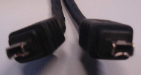
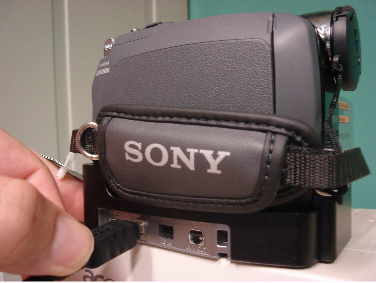
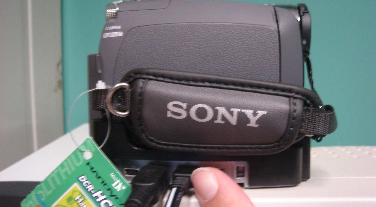
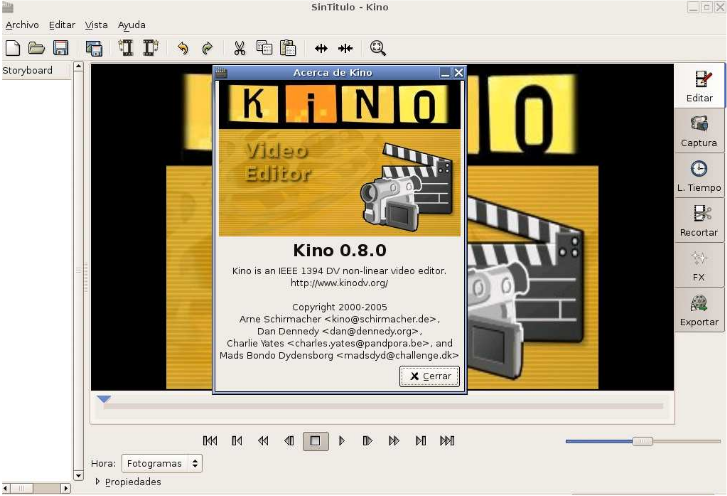
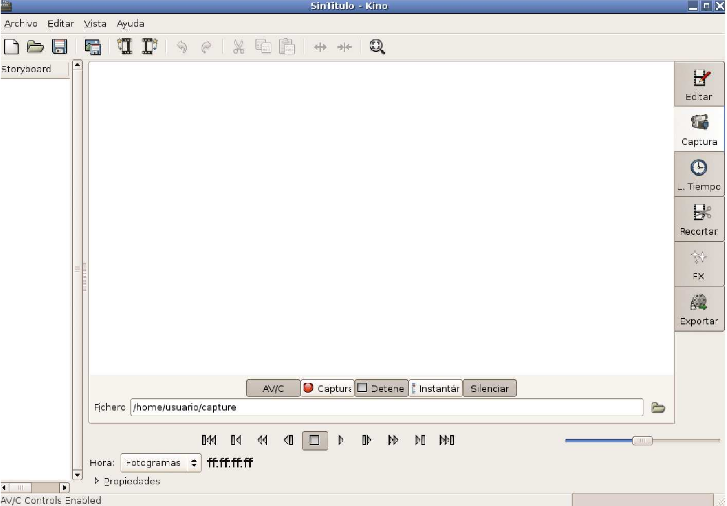
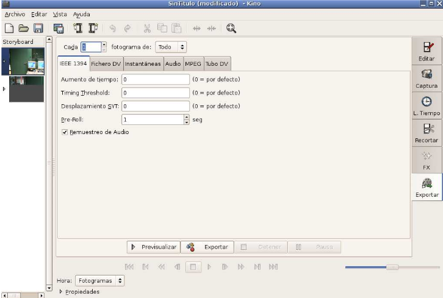
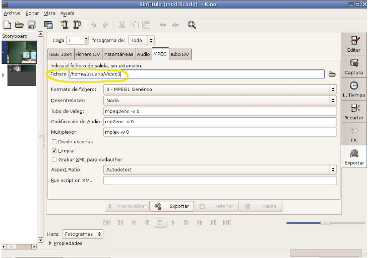
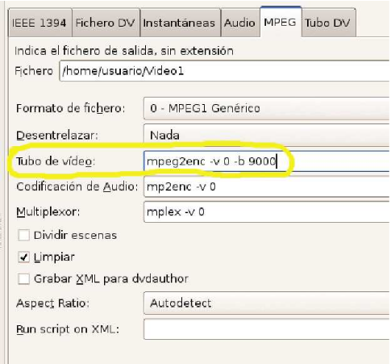
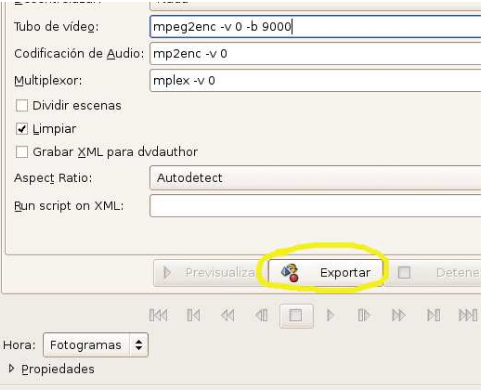

# Manual de uso de la cámara de vídeo digital (Captura de vídeo con Kino

En este manual vamos a describir el proceso a seguir para extraer vídeo digital desde una cámara de vídeo digital utilizando Guadalinex-V3. Necesitaremos:

* Ordenador con puerto Firewire incorporado.
* Sistema operativo Guadalinex V3 con Kino 0.8 instalado.
* Videocámara digital Sony DCR-HC30E, HC32E ó HC35E.

## Cómo conectar la videcámara con el equipo

En primer lugar conectaremos la videocámara al equipo. Para ello vamos a utilizar un cable firewire 4 a 4 como el que se observan en las siguientes imágenes.

Es posible que el puerto firewire del equipo donde vayamos a conectar la cámara digital sea de 6 contactos, en tal caso utilizaremos un cable firewire 6 a 4.

Para conectar la videocámara Sony HC35E utilizaremos la base de la que viene provista, de forma que la videocámara quede anclada en la misma. Con el resto de cámaras de la dotación el conector estará oculto tras alguna tapa de plástico en la misma cámara. Conectaremos el firewire tal y como se muestra en la siguiente imagen

Conexión de la alimentación

Ya tenemos la cámara conectada con nuestro ordenador, ahora vamos a ver como se captura una secuencia de vídeo y se transforma a formato MPEG para poderlo visualizar en nuestro ordenador. Esto igualmente es aplicable a los otros modelos (HC30E y HC32E).

## Aplicación Kino

Para capturar las secuencias de vídeo que tengamos grabadas con nuestra cámara digital vamos a utilizar la aplicación de captura y edición de vídeo llamada Kino, incluida en Guadalinex V3 educación. Usaremos la versión 0.8 que es la más reciente a la hora de realizar el manual. Lo primero que hacemos es arrancar la aplicación que se encuentra en Aplicaciones / Sonido y Video / Kino.

Podemos ver una ventana central que va a ser nuestra pantalla donde se visualizan los vídeos que tengamos capturados. En la parte superior podemos ver la barra principal de tareas donde se encuentras los accesos directos a las funciones más habituales de Kino, como por ejemplo abrir un fichero, guardar fichero, cortar, pegar o configurar. A la izquierda podemos ver un cuadro blanco, en este espacio se muestran pequeños screenshots de los vídeos que hayamos capturado (inicialmente se encuentra vacío). En la parte inferior podemos ver los controles del editor de vídeo; con ellos podemos reproducir, parar, avanzar y retroceder cualquier vídeo capturado. Por último, en la parte derecha observamos seis pestañas con los menús para elegir la operación que queremos realizar en cada momento en Kino (inicialmente esta seleccionada la pestaña Edit).

Una vez que estamos familiarizados con el entorno vamos a realizar una captura para mostrar cual es el proceso a seguir para obtener un fichero de vídeo reproducible en Guadalinex V3. 

* Paso 1: Extraer una secuencia de vídeo de la videocámara.

    Pinchamos con el ratón en la pestaña Captura y nos aparecerá la siguiente ventana:

    

    Podemos comprobar que esta ventana es bastante similar a la anterior, pero presenta una diferencia. Hay un nuevo grupo de botones justo debajo de la pantalla central. Estos botones sirven para controlar la captura que vamos a realizar. Veamos para que sirven cada uno de estos botones:

    * AV/C: Sirve para activar o desactivar el control de la cámara desde Kino.
    * Captura: Con el iniciamos el proceso de captura de vídeo.
    * Detener: Nos permite detener la captura que se esté realizando.
    * Insertar: Se utiliza para realizar un congelado en la captura en curso.
    * Silenciar : Activa y desactiva el audio del vídeo.

* Paso 2: Pulsaremos con el ratón en el botón AV/C (si la cámara no está conectada o está conectada incorrectamente este botón no se encontrará activado), vemos como inmediatamente se activan los controles de vídeo que están exactamente debajo. Con estos controles ahora podemos manejar las funciones de VCR de la cámara desde Kino. 

* Paso 3: En el cuadro de texto etiquetado con Fichero seleccionamos el lugar donde queremos guardar nuestras capturas.

    

* Paso 4: Para comenzar la captura de vídeo tenemos que pulsar el botón de Captura, en este instante comienza la captura de vídeo (es muy posible al capturar se quede la ventana central congelada en una imagen o en negropero esto no supone ningún problema porque el vídeo se capturará correctamente). Cuando queramos terminar la captura del vídeo pulsamos el botón Detener. Ya tenemos una secuencia de vídeo capturada.

* Paso 5: Nos vamos a la pestaña Editar y vemos como ahora ya nos aparece la secuencia que acabamos de capturar. Aquí podemos ver el resultado y editarlo, según nuestras necesidades, añadiendo secuencias o eliminado algunas de ellas. Una vez que ya tenemos editado el vídeo a nuestro gusto pasamos a comprimir.

* Paso 6: Para comprimir la captura a uno de los formatos de vídeo disponibles en Kino pinchamos con el ratón en la pestaña Exportar, vemos que nos aparece una nueva ventana donde podemos observar un nuevo cuadro central con otras pestañas.

    

    Seleccionamos la pestaña MPEG. En la imagen siguiente apreciamos lo que nos muestra Kino en esta pestaña.

    

    Antes de comenzar a comprimir el vídeo tendremos que configurar algunos parámetros en los cuadros de texto que se observan en la imagen. Primero tenemos que indicar el fichero donde queremos que Kino nos guarde el vídeo, eso lo seleccionamos en el cuadro de texto etiquetado por Fichero, indicamos la ruta y el nombre del fichero (señalado en amarillo en la imagen anterior), en nuestro caso Video1 como nombre de fichero y `/home/usuario` ruta donde queremos almacenar el archivo.

    

    A continuación elegimos el formato de vídeo que queremos obtener en el menú desplegable Formato de fichero, nosotros hemos elegido 0-MPEG1 Genérico aunque podemos seleccionar cualquiera de los que tenemos disponible. Por último, tenemos que indicar en el cuadro de texto Tubo de Video cual es el bitrate que queremos que tenga nuestro vídeo, para ello sólo tenemos que añadir al final de la línea del cuadro de texto la opción -b y un número valor que indica el bitrate, nosotros hemos elegido -b 9000 pero esta cifra se puede modificar según las preferencias del usuario.

    Para acabar nos queda comprimir el vídeo, para ello pulsamos el botón Exportar como se muestra en la figura. En la parte inferior de la ventana vemos la información del proceso que se está realizando. Cuando veamos el mensaje Finalizó la exportación sabremos que el proceso ha terminado con éxito.

    

    Para comprobar el resultado podemos abrir el fichero que hemos generado con un programa de visualización de videos, por ejemplo, Aplicaciones / Sonido y video / Reproductor de video (GXine).

## Transformar de MPEG a AVI

Para pasar de MPEG a AVI se hace el siguiente proceso:
Exportar / Tubo DV / utilidad / MPEG -4 AVI Single Pass (FFMPEG)

> Referencias:
> Guía de Centros TIC (CGA) (http://www.juntadeandalucia.es/averroes/guadalinex/files/guia_centros_tic.pdf

> Este documento se distribuye bajo una licencia Creative Commons Reconocimiento-NoComercial-CompartirIgual

> Reconocimiento. Debe reconocer los créditos de la obra de la manera especificada por el autor o el licenciador.
> No comercial. No puede utilizar esta obra para fines comerciales.
> Compartir bajo la misma licencia. Si altera o transforma esta obra, o genera una obra derivada, sólo puede distribuir la obra generada bajo una licencia idéntica a ésta.

> Para más información visitar: http://creativecommons.org/licenses/by-nc-sa/2.5/es/