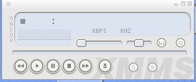

# Trabajando con video y sonido

¿Cómo ver películas DVD? 
El procedimiento para ver un dvd será tan simple como 

<ul><li> Abrir físicamente la bandeja del lector de DVD
</li><li> Colocar el DVD en la bandeja del lector
</li><li> Cerrar la bandeja y esperar.
</li></ul>

Automáticamente se reproducirá el contenido del DVD con el programa <a href="http://es.wikipedia.org/wiki/Totem">Totem</a>.

<h4> Explicación Animada </h4>

 (<i>http://www.guadalinex.org/guadapedia/images/3/3f/Dvdcon.gif</i>) Pincha en la imagen para ver la animación a su tamaño completo.

¿Cómo ver vídeos avi o mpeg?

Los vídeos se pueden ver también con el programa Totem, con el programa GXine, o con el vlc. 

 

¿Cómo reproducir un CD de audio?

Reproducir un CD de música ?normal? en
Guadalinex V.3 es sumamente sencillo: basta con introducirlo en la
bandeja (si el ordenador tiene lector, claro está). El CD se
reproducirá entonces automáticamente. El programa que se utiliza para reproducir música se llama XMMS. 

 

¿Cómo escuchar la radio en Guadalinex?

Para ello utilizamos el programa StreamTuner. 

 

 

Este documento se distribuye bajo una licencia Creative Commons Reconocimiento-NoComercial-CompartirIgual 
 Reconocimiento. Debe reconocer los créditos de la obra de la manera especificada por el autor o el licenciador. No comercial. No puede utilizar esta obra para fines comerciales. Compartir bajo la misma licencia. Si altera o transforma esta obra, o
genera una obra derivada, sólo puede distribuir la obra generada bajo
una licencia idéntica a ésta. 
 
 
Para más información visitar: http://creativecommons.org/licenses/by-nc-sa/2.5/es/

 

